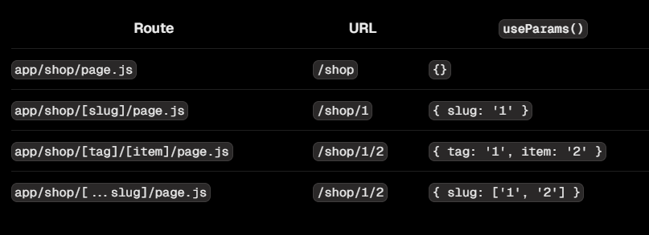

# useParams()

:::info

- Hook **useParams()** được sử dụng trong [client component](../rendering#client-component) để lấy giá trị dynamic params từ [dynamic route](../routing/dynamic-route)

:::

- Ví dụ:

```ts
"use client";

import { useParams } from "next/navigation";

export default function ExampleClientComponent() {
  const params = useParams<{ tag: string; item: string }>();

  // Route -> /shop/[tag]/[item]
  // URL -> /shop/shoes/nike-air-max-97
  // `params` -> { tag: 'shoes', item: 'nike-air-max-97' }
  console.log(params);

  return "...";
}
```


