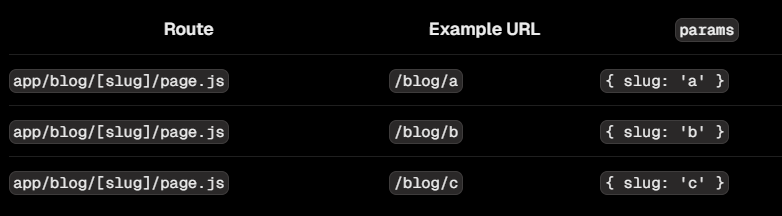

# Dynamic Route

:::info

- Ta tạo dynamic route bằng cách tạo folder bao bọc bởi dấu ngoặc vuông: **[folderName]**

:::

- Ví dụ, một blog có thể bao gồm route sau đây: **app/blog/[slug]/page.js**. Trong đó, **[slug]** là dynamic segment cho các bài viết của blog

```tsx title="app/blog/[slug]/page.tsx"
export default function Page({ params }: { params: { slug: string } }) {
  return <div>My Post: {params.slug}</div>;
}
```



:::note

- Trong server component, ta có thể lấy params như ở ví dụ trên.
- Trong client component, ta có thể lấy params thông qua hook `useParams()`

:::
