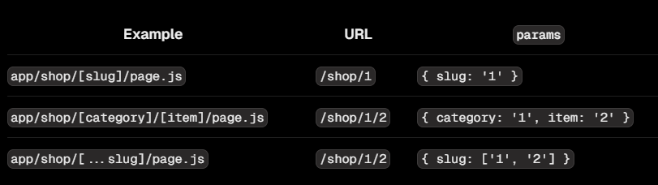

# Dynamic Route

:::info

- Ta tạo dynamic route bằng cách tạo folder bao bọc bởi dấu ngoặc vuông: **[folderName]**

:::

- Ví dụ, một blog có thể bao gồm route sau đây: **app/blog/[slug]/page.js**. Trong đó, **[slug]** là dynamic segment cho các bài viết của blog

```tsx
export default function Page({ params }: { params: { slug: string } }) {
  return <div>My Post: {params.slug}</div>;
}
```




## Cách lấy params trong server component và client component

- Đối với mỗi [server component](../rendering#server-component), nó nhận một props tên **params** chứa tất cả các params của route:

```ts
export default function Page({ params }: { params: { slug: string } }) {
  return <div>My Post: {params.slug}</div>;
}
```

- Đối với [client component](../rendering#client-component), để lấy params, ta sử dụng hook [useParams()](../functions/useParams)
