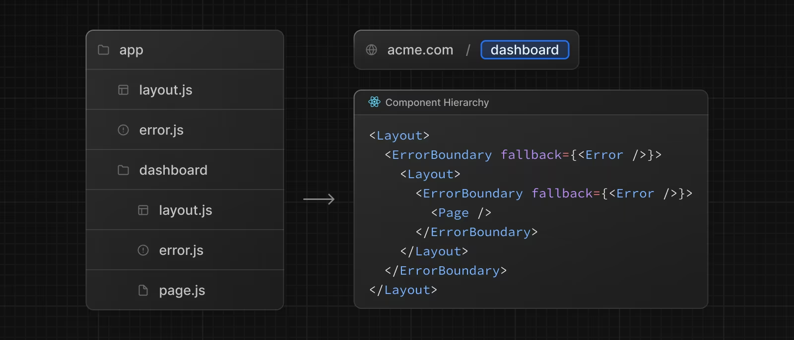

# Error UI

:::info

- Nếu như Loading UI hiển thị khi server component đang thực hiện tác vụ bất đồng bộ (ví dụ như đang lấy dữ liệu từ API) thì Error UI sẽ hiển thị khi server component throw ra lỗi.

:::

## Tạo Error UI

- Ta tạo file **error.tsx**, và nó phải là client component



- Tương tự như Loading UI, ta có thể tạo nested Error UI cho các nested route. Với mỗi nested route, nó sẽ lấy Error UI đầu tiên mà nó tìm thấy từ trong ra ngoài.
- Ví dụ dưới đây ta tạo Error UI cho tất cả các page trong ứng dụng bằng cách tạo file **error.tsx** ở cấp độ cao nhất bên trong thư mục **app**:

```tsx title="app/error.tsx"
"use client";

import WarningIcon from "src/assets/icons/WarningIcon";
import ErrorStatus from "src/components/status/ErrorStatus";

export default function GlobalError() {
  return (
    <div className="absolute inset-0 m-auto flex flex-col items-center justify-center">
      <WarningIcon className="size-20" />
      <p className="mt-6 text-4xl font-semibold">Something went wrong !</p>
      <p className="mt-3 font-medium text-muted-foreground">
        Please refresh page to load data
      </p>
    </div>
  );
}
```
