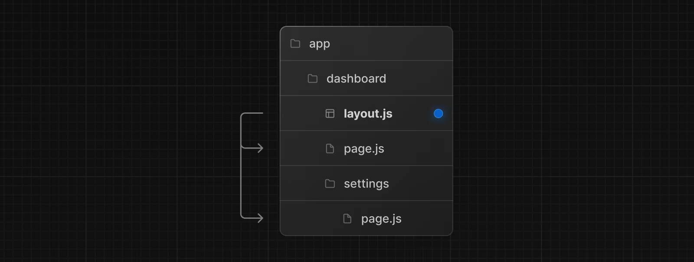
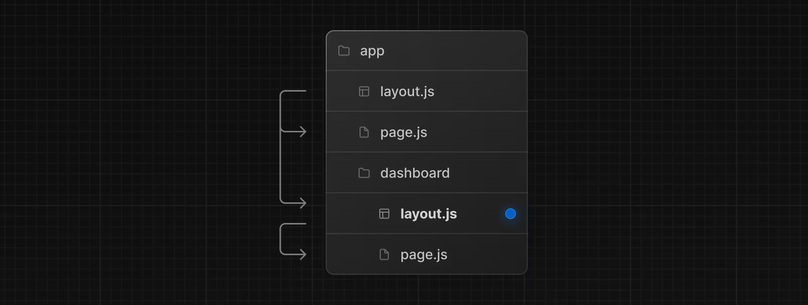

# Layout

## Định nghĩa Layout

:::info

- Trong Next.js, **Layout** là một thành phần (component) được sử dụng để tạo cấu trúc chung cho các trang web, cho phép ta định nghĩa các phần cố định như tiêu đề (header), thanh điều hướng (navigation bar), chân trang (footer) hoặc các phần khác mà bạn muốn xuất hiện trên nhiều trang của ứng dụng.
- Layout giúp ta tái sử dụng các phần của trang mà không cần lặp lại mã trong mỗi trang.
- Ta định nghĩa layout bằng cách tạo file **layout.tsx** và export ra một React component. Component này phải nhận `children` làm props để có thể render ra nội dung của các trang sử dụng layout này.

:::

- Ví dụ dưới đây ta sẽ định nghĩa layout cho **/dashboard** và **/dashboard/settings**:



```tsx
export default function DashboardLayout({
  children, // will be a page or nested layout
}: {
  children: React.ReactNode;
}) {
  return (
    <section>
      {/* Include shared UI here e.g. a header or sidebar */}
      <nav></nav>

      {children}
    </section>
  );
}
```

## Root Layout

:::info

- Root layout được định nghĩa ở cấp cao nhất bên trong thư mục **app**, và nó áp dụng cho tất cả các route trong ứng dụng. Root layout bắt buộc phải định nghĩa vì nó chứa thẻ `html`, `body` (là các thẻ gốc cần có của một trang web).

:::

```tsx
export default function RootLayout({
  children,
}: {
  children: React.ReactNode;
}) {
  return (
    <html lang="en">
      <body>
        {/* Layout UI */}
        <main>{children}</main>
      </body>
    </html>
  );
}
```

## Nest Layout

- **Nest Layout** trong Next.js là một kỹ thuật sử dụng nhiều layout lồng nhau để tổ chức và quản lý cấu trúc của ứng dụng theo cách linh hoạt hơn. Khi ta sử dụng Nest Layout, ta có thể áp dụng các layout khác nhau cho các phần khác nhau của ứng dụng hoặc tạo các layout con bên trong một layout chính.
- Khi đặt layout bên trong một thư mục route, layout này sẽ bao bọc page của route hiện tại và tất cả các route con bên trong nó.
- Ví dụ sau, ta sẽ tạo layout cho route **/dashboard**:



```tsx
export default function DashboardLayout({
  children,
}: {
  children: React.ReactNode;
}) {
  return <section>{children}</section>;
}
```

- Trong ví dụ trên, root layout (**app/layout.js**) sẽ bao bọc dashboard layout (**app/dashboard/layout.js**). Dashboard layout này sẽ bao bọc tất cả các route bên trong **app/dashboard/\***

## Một số lưu ý về Layout

:::note

- Khi một **layout.tsx** định nghĩa cùng cấp với **page.tsx**. Layout sẽ bao bọc page này.
- Layout là một server component, nhưng ta có thể chỉnh thành Client component.
- Layout có thể fetching data. Xem fetching data tại đây.

:::
