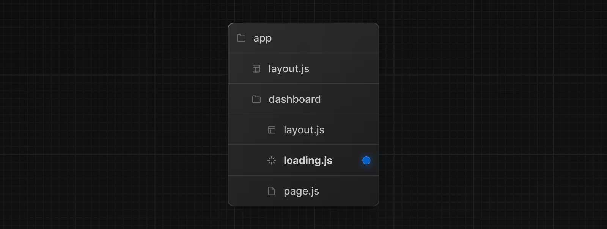
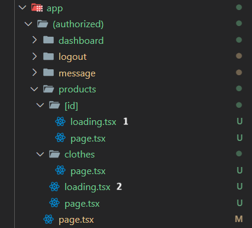

# Loading UI

:::info

- Trong Next.js, "Loading UI" hay giao diện tải dữ liệu là một thành phần giao diện người dùng được hiển thị trong thời gian chờ khi dữ liệu đang được tải hoặc xử lý. Đây là một phần quan trọng trong trải nghiệm người dùng để giảm cảm giác chờ đợi, bằng cách hiển thị một biểu tượng, hoạt ảnh hoặc một đoạn văn bản nào đó báo hiệu rằng hệ thống đang trong quá trình xử lý.
- Ví dụ khi ta điều hướng sang 1 page là [server component](../rendering#server-component) mà nó đang thực hiện việc gọi API lấy dữ liệu. Lúc này, Loading UI sẽ hiển thị giúp trải nghiệm người dùng tốt hơn.
- Chú ý rằng khi điều hướng sang 1 page là [client component](../rendering#client-component) thì Loading UI sẽ không được hiển thị do về bản chất, client component sẽ render phần tử html trên trình duyệt.
- Ta có thể tạo Loading UI bằng cách tạo file tên: **loading.tsx** bên trong thư mục route.

:::



```tsx title="app/dashboard/loading.tsx"
export default function Loading() {
  // You can add any UI inside Loading, including a Skeleton.
  return <LoadingSkeleton />;
}
```

## Nested Loading UI

- Ta có thể tạo nested Loading UI cho các nested route. Với mỗi nested route, nó sẽ lấy Loading UI đầu tiên mà nó tìm thấy từ trong ra ngoài.



:::note

- Trong ảnh trên, route **/products/[id]** sẽ lấy Loading UI ở file số 1
- Route **/products** và **/products/clothes** sẽ lấy Loading UI ở file số 2

:::
