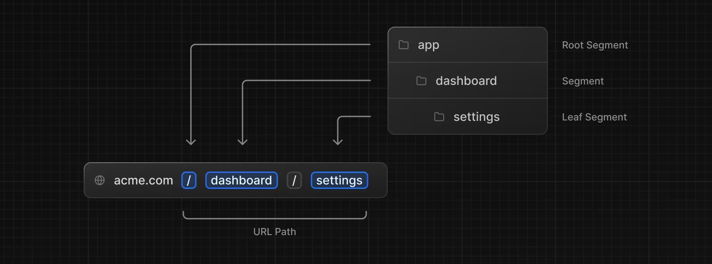
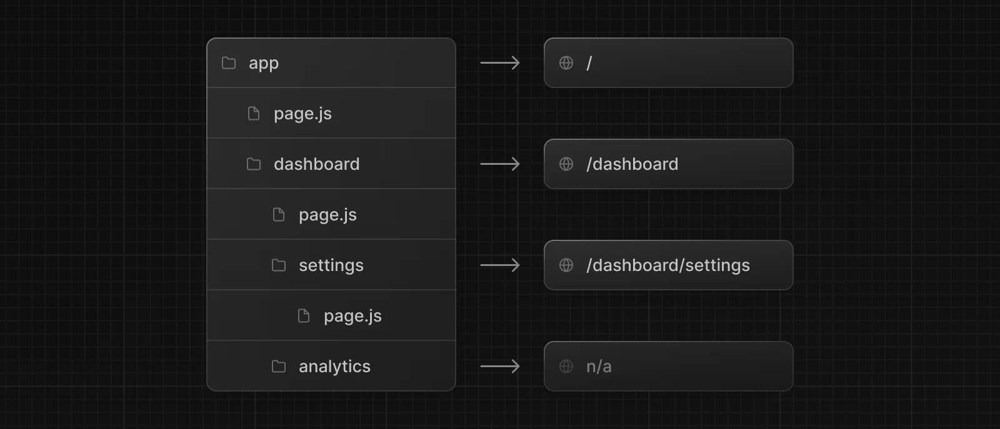

# Định nghĩa route

:::info

- NextJS sử dụng bộ định tuyến (route) dựa trên hệ thống thư mục.
- Để tạo route, ta tạo thư mục với tên route trong thư mục **app**.
- Sau đó, tại mỗi thư mục route, ta tạo file tên: **page.tsx** để định nghĩa nội dung cho route.

:::

:::note

- Ở ảnh bên trên, URL `/dashboard/analytics` sẽ không truy cập được vì trong thư mục đó không có file **page.tsx**. Folder này sẽ thường được sử dụng để lưu trữ các components, stylesheets, images,...

:::
