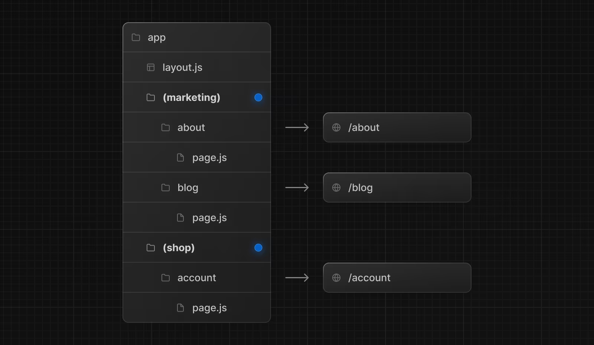
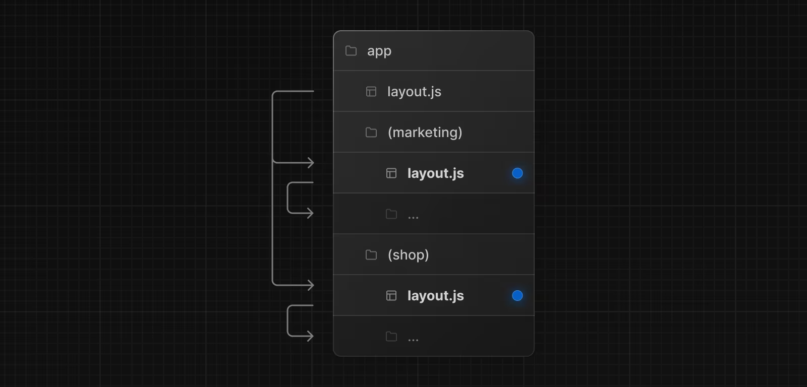
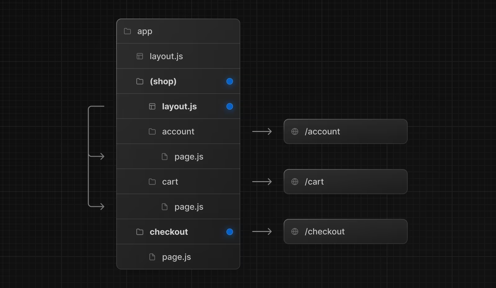

# Route groups

:::info

- **Route Groups** trong Next.js là một tính năng cho phép ta nhóm các route (đường dẫn) lại với nhau để tổ chức và quản lý các route một cách hiệu quả hơn mà không ảnh hưởng đến cấu trúc URL của ứng dụng. Tính năng này đặc biệt hữu ích khi ta muốn nhóm các trang với nhau theo một chủ đề hoặc khu vực chức năng nhưng không muốn thay đổi cấu trúc của đường dẫn URL.
- Ta có thể dùng Route groups để chỉ định một route con không hoặc có áp dụng một layout.
- Để tạo một route groups, ta tạo một folder và tên folder đặt trong dấu ngoặc đơn: **(folderName)**

:::

- Mặc dù các route bên trong **(marketing)** và **(shop)** cùng cấp, nhưng ta có thể tạo layout riêng cho chúng:

:::caution

- Lưu ý, khi tạo folder route group, nó sẽ không ảnh hưởng đến cấu trúc URL, do đó, nếu ta tạo **(marketing)/about/page.js** và **(shop)/about/page.js** sẽ bị conflict do ta đang định nghĩa cả 2 page **about** ở cùng cấp độ URL.

:::

## Chọn các route cụ thể được layout áp dụng vào

- Trong ví dụ dưới đây, ta tạo một route group **(shop)**, bỏ page **account** và **cart** vào route group đó để sử dụng chung layout, còn page **checkout** không muốn sử dụng chung layout thì bỏ ra ngoài route group:

