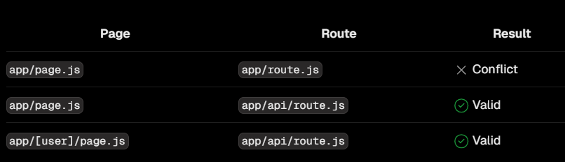
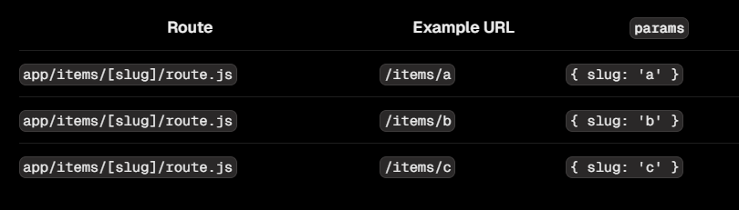

# Route Handlers

## Route Handlers là gì?

:::info

- Route handler cho phép ta viết 1 API như backend. Nhận request và trả về response.
- Ta có thể định nghĩa các phương thức **GET**, **POST**, **PUT**, **DELETE**,... tương ứng với các HTTP Methods.

:::

:::note

- Một số lưu ý về Route Handlers:
  - Route handlers không tham gia vào layouts hay client-side như **page.tsx**
  - Không thể có **route.js** cùng cấp độ với file **page.js**



:::

## Tạo Route Handler

:::info

- Để tạo route handler, ta tạo file tên **route.ts** ở bên trong thư mục **app/api/...**
- Ví dụ, ta tạo **app/api/user/route.ts** và định nghĩa các phương thức **GET**, **POST**, **PUT**, **DELETE**,... thì tương ứng với việc ta đang tạo endpoint **/api/user** như ở RESTful API

:::

- Tạo phương thức **GET** với endpoint **/api/user**:

```ts title="app/api/user/route.ts"
import { NextRequest, NextResponse } from "next/server";

export const GET = async (req: NextRequest, res: NextResponse) => {
  return NextResponse.json({ message: "Ok" });
};
```

:::note

- Với mỗi hàm ta định nghĩa tương ứng với method cho endpoint, nó nhận 2 tham số là [NextRequest](../functions/next-request) và [NextResponse](../functions/next-response), tương ứng với đối tượng request nhận được và response trả về.

:::

## Một số ví dụ về Route Handler

### Lấy cookies

- Có 2 cách lấy cookies từ request: sử dụng hàm [cookies()](../functions/cookies) hoặc lấy ra từ đối tượng [NextRequest](../functions/next-request):

```ts title="app/api/route.ts"
import { cookies } from "next/headers";

export async function GET(request: Request) {
  //Cách 1
  const cookieStore = cookies();
  const token = cookieStore.get("token");

  //Cách 2
  const token = request.cookies.get("token");

  return new Response("Hello, Next.js!", {
    status: 200,
    headers: { "Set-Cookie": `token=${token.value}` },
  });
}
```

### Lấy headers

- Tương tự, có 2 cách lấy thông tin header từ request: sử dụng hàm [headers()](../functions/headers) hoặc lấy ra từ đối tượng [NextRequest](../functions/next-request):

```ts title="app/api/route.ts"
import { headers } from "next/headers";

export async function GET(request: Request) {
  // Cách 1
  const headersList = headers();
  const referer = headersList.get("referer");

  // Cách 2
  const requestHeaders = new Headers(request.headers);

  return new Response("Hello, Next.js!", {
    status: 200,
    headers: { referer: referer },
  });
}
```

### Redirect

- Ta có thể sử dụng hàm [redirect()](../functions/redirect) để điều hướng đến URL khác:

```ts title="app/api/route.ts"
import { redirect } from "next/navigation";

export async function GET(request: Request) {
  redirect("https://nextjs.org/");
}
```

### Dynamic route handler

```ts title="app/items/[slug]/route.ts"
export async function GET(
  request: Request,
  { params }: { params: { slug: string } }
) {
  const slug = params.slug; // 'a', 'b', or 'c'
}
```



### URL Query Parameters

```ts title="app/api/search/route.ts"
import { type NextRequest } from "next/server";

export function GET(request: NextRequest) {
  const searchParams = request.nextUrl.searchParams;
  const query = searchParams.get("query");
  // query is "hello" for /api/search?query=hello
}
```

### Request Body

```ts title="app/items/route.ts"
export async function POST(request: Request) {
  const res = await request.json();
  return Response.json({ res });
}
```

### Request Body FormData

```ts title="app/items/route.ts"
export async function POST(request: Request) {
  const formData = await request.formData();
  const name = formData.get("name");
  const email = formData.get("email");
  return Response.json({ name, email });
}
```

### CORS

```ts title="app/api/route.ts"
export async function GET(request: Request) {
  return new Response("Hello, Next.js!", {
    status: 200,
    headers: {
      "Access-Control-Allow-Origin": "*",
      "Access-Control-Allow-Methods": "GET, POST, PUT, DELETE, OPTIONS",
      "Access-Control-Allow-Headers": "Content-Type, Authorization",
    },
  });
}
```
